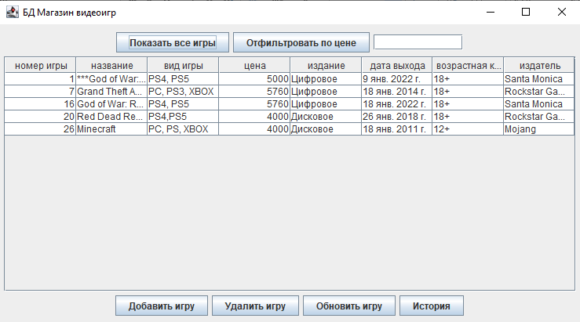
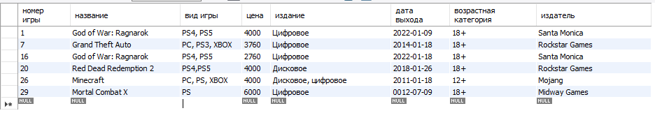
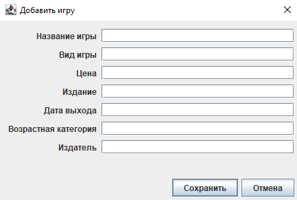
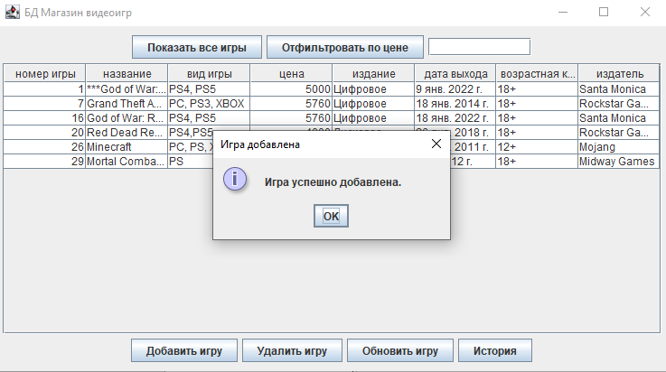
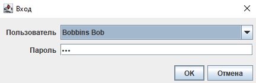
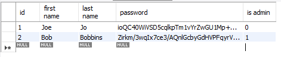

# Database Management App
I made this app to learn how to create Java desktop applications.

The app is intended to use in an imaginary video game store to manage its goods.

## Tech Stack
- Java 17 
- MySQL
- JDBC
- Swing

## Key features
- Basic data entries editing 
- User login
- Entry changes history
- Filter search
- Encrypted password storing

## Demo
>Since this project was a part of my coursework at SUAI, the interface and the data is presented in Russian.

##### Main window
Here all the management takes place. There are buttons to:
- Show all games
- Filter search
- Add game
- Delete game
- Update game
- See history

Following is an example of the entries from MySQL Workbench

### Editing database
Adding a game entry looks like this:

After a succesful adding the pop-up comes up

The update and delete features are pretty much the same, except that firstly you need to click the game you want to update/delete, so I won't be showing them here.

### User login
When the user starts the app, login and password is required to proceed.

All the passwords are stored encrypted using [Jasypt](http://jasypt.org/) which looks like this:

###### This was interesting and fun to make! Special thanks to [luv2code](https://www.youtube.com/playlist?list=PLEAQNNR8IlB4R7NfqBY1frapYo97L6fOQ).